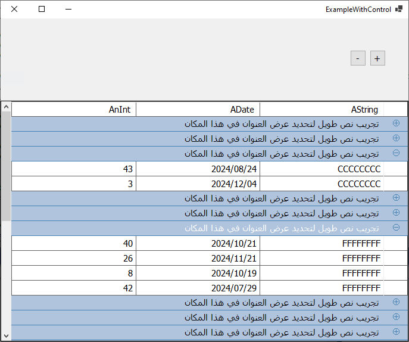

**DataGridViewGrouper**
A control that allows DataGridView to view data in groups.

Forked from https://github.com/vivekthangaswamy/DataGridViewGrouper

    - Cleaning the code.
    - Upgrade from .net framework to .Net Core 8
    - Adding RTL support.
    - Simplifying function.

